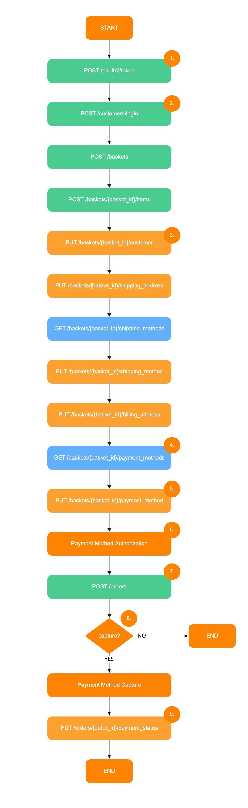

# Livescale Shopping API Standard Flow

This document is ment to help you understand the standard flow of a customer journey. The flow below represent the call made by Livescale to the server implementation during a Live Event. More details can be found below the flow. 

## Flow

 

1. When a person join the live event, the endpoint **/oauth/token** is called with the *client_id* and *client_secret* provided in the Livescale Dashboard. The grant_type parameter will be **"client_credentials"**. We expect to receive back an **"access_token"**. This **"access_token"** will be used in every subsequent calls. If the request failed client authentication or is invalid, the authorization server returns an error response. Upon reception of the error response, a */oauth/token* call will be placed to get a new **"access_token"**. The audience field will always be **"livescale"**. The Authorization section of this API specification is conform to the [RFC 6749](https://tools.ietf.org/html/rfc6749)
2. When a customer start a checkout interaction, the endpoint **/customers/login** is called with type **"guest"**. Some e-commerce requires a specific *customer_token*. In that case the server will be responsable to link the *customer_token* and the *access_token* together to keep track of this customer.
3. The only type of basket supported at the moment is **"guest"**. The endpoint **/baskets/{basket_id}/customer** is typically used to set the email address on the basket.
4. After setting the billing address on the basket, a get **/baskets/{basket_id}/payment_methods** is asked. Only a **"LIVESCALE"** payment method is currently supported and this payment method must be returned by this endpoint.
5. The payment method id **"LIVESCALE"** is going to be sent in this endpoint payload.
6. Livescale is doing the **Credit Card Tokenization** and **Authorization** on the Merchant PSP using the PCI-compliant Livescale's Payment Orchestrator.
7. The PSP *transaction_id* is provided in this endpoint's payload. This PSP *transaction_id* should be stored on the Merchant system for post order purposes such as refund.
8. In the Livescale Admin Dashboard the Merchant is able to decided to Capture of the funds later in their payment process. If Livescale is not doing the Capture the order, the flow will end there.
9. If Livescale is doing the Capture, the capture will be made against the Merchant PSP and a payment status will be sent. In the case of a failed capture, a reason will be added to the payload.
